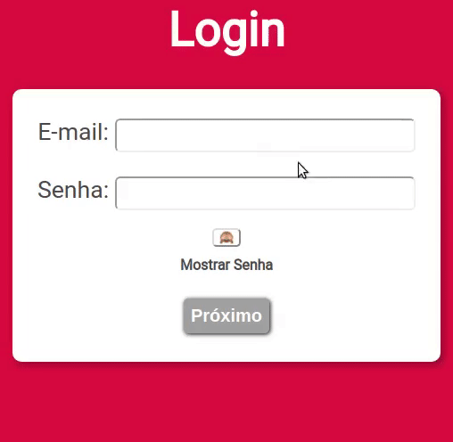

# Login Page
  Simple login page using HTML5, CSS and JavaScript.
  
  [**Acess here**](https://weltonfelix.github.io/login)
  
  <p align="center">
  

  
	
  <a href="https://www.github.com/weltonfelix">
    
  </a>

  <a href="https://github.com/weltonfelix/login/commits/master">
    
  </a>

  <a href="https://github.com/weltonfelix/login/issues">
    
  </a>
  
</p>

<h3 align="center">
	
</h3>

## :gear: Features
### :monkey_face: Hide / Show Password
  Click on the monkey button to hide/show your password.
  ```
    function showHide(){
      const txt = document.querySelector('span#txtSH')
       if(pswd.type == 'password'){
            pswd.type = 'show'
            monkey.value = '🐵'
        txt.innerText = 'Ocultar Senha'
        }else{
            pswd.type = 'password'
            monkey.value = '🙈'
        txt.innerText = 'Mostrar Senha'
        }
    }

  ```
  
### :heavy_check_mark: Email and Password validation.
  While user types, the data is validated.
  ```
  function emailValidation(){
    var MVF = document.getElementById('emailValidationField') // Mail Validation Field recebe o campo
    var atPos = email.value.indexOf('@')
    mailUser = email.value.substring(0, atPos)
    var domain = email.value.substring(atPos + 1, email.value.length)
    const criteria = (mailUser.length >= 1) && (domain.length>=4) && (mailUser.search('@') == -1) && (domain.search('@') == -1) && (mailUser.search(' ') == -1) && (domain.search(' ') == -1) && (domain.search('.' != -1)) && (domain.indexOf('.')>=1) && (domain.lastIndexOf('.') < (domain.length - 1))
    if (criteria){
      MVF.innerHTML = ''
      email.className = emailClass
      isEmailValid = true
    }
    email.onblur = function(){
      if(email.value.length == 0){
        MVF.innerHTML = ''
        email.classList.remove('ferror')
      }
      if (!criteria){
        if(email.value.length != 0){		
          MVF.innerHTML = "<span class='dataerror' style='color: red'>Verifique o e-mail, ele deve estar no formato: meuemail@email.com</span>"
          email.classList.add('ferror')
        }
        isEmailValid = false
      }
    }
    canLogin()
  }
  ``` 
  
  ```
  function passwordValidation(){
    const PVF = document.querySelector('span#passwordField')
    var criteria = (pswd.value.length >= 8) && (pswd.value != email.value) && (pswd.value != mailUser)
    if(criteria){
      PVF.innerHTML = ' '
      isPasswordValid = true
    }
    pswd.onblur = function(){
      if(criteria){
        PVF.innerHTML = ' '
        pswd.classList.remove('ferror')
        isPasswordValid = true
      }
      if (!criteria){
        if(pswd.value.length != 0){
          PVF.innerHTML = "<br><span class='dataerror' style='color: red'>A senha deve ter pelo menos 8 caracteres e ser diferente do E-mail</span><br>"
          pswd.classList.add('ferror')
        }else{
          PVF.innerHTML = ' '
          pswd.classList.remove('ferror')
        }
        isPasswordValid = false
      }
    }
    canLogin()	
  }
  
  ```
  
  After data validation, the login button is activated.
      
    function canLogin(){
      if (isEmailValid && isPasswordValid){
        next.disabled = false
        next.classList.remove('inative')
      }else{
        next.disabled = true
        next.classList.add('inative')
      }
    }

## 🤝 Contributing

Contributions, issues and feature requests are welcome!<br />Feel free to check [issues page](https://github.com/weltonfelix/login/issues).
- Make a fork;
- Create a branck with your feature: `git checkout -b my-feature`;
- Commit changes: `git commit -m 'feat: My new feature'`;
- Make a push to your branch: `git push origin my-feature`.

After merging your receipt request to done, you can delete a branch from yours.

## Show your support

Give a ⭐️ if this project helped you!

## :memo: License

This project is under the MIT license. See the [LICENSE](LICENSE.md) for details.

---

Made with ♥ by Welton Felix :wave: [Get in touch!](mailto:contato.weltonf@gmail.com)
